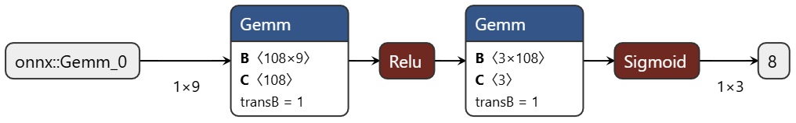

# Usage

### 1. 修改配置
在 `config.py` 中修改相关配置，如数据路径、模型路径等。

如需更替基模型文件，将 PatchTST 和 Informer 的模型文件放在 `./saved_models/PatchTST` 或 `./saved_models/Informer`，并命名为相应目标域数据集的名称，例如 `s0.3548_m907.pth`。

### 2. 脚本执行
在项目根目录下有 `exp.sh` 脚本，可以直接运行该脚本进行训练和测试。

```shell
sh exp.sh
```
之后，日志会保存在 `logs` 文件夹中，结果会保存在 `results` 文件夹中。

---

如果要自定义训练和测试，可以使用以下命令。

#### 训练模型
须指定数据集名称。

可以指定训练选择器的数据集路径，默认是 `./dataset/5138`。
```shell
python run.py --train --dset s0.3548_m907

python run.py --train --dset CAV-H

python run.py --train --dset HTV2
```

#### 测试模型
须指定数据集名称和数据集大小。

```shell
python run.py --test --dset s0.3548_m907 --dset_size 5138

python run.py --test --dset HTV2 --dset_size 10276

python run.py --test --dset CAV-H --dset_size 20552
```

### 使用陪试模型(stacking)
在运行训练和测试时，添加参数 `--ensemble_mode stacking` 即可使用陪试模型。
```shell
python run.py --train --dset s0.3548_m907 --ensemble_mode stacking
python run.py --test --dset s0.3548_m907 --dset_size 20552 --ensemble_mode stacking
```

# 选择器模型可视化
